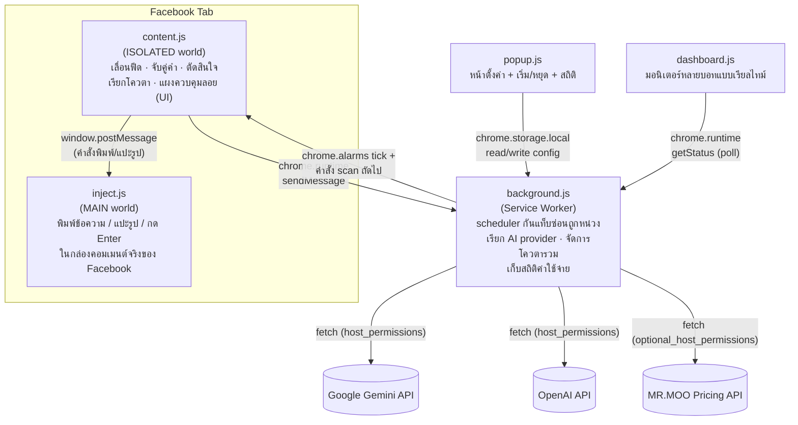

# 🎬 MR.MOO Ticket Scanner

**Chrome Extension (Manifest V3) ที่สแกนฟีดกลุ่ม Facebook แบบเรียลไทม์ ตรวจจับโพสต์ "ตามหาตั๋วหนัง" ด้วยการผสม Keyword Matching + LLM (Gemini / OpenAI) แล้วตอบกลับลูกค้าอัตโนมัติ**
พร้อมระบบจำกัดอัตรา (rate limiting), โหมดยืนยันก่อนส่งเพื่อลดความเสี่ยงโดนแบน, และแดชบอร์ดสำหรับมอนิเตอร์บอทหลายตัว/หลายกลุ่มพร้อมกัน


---

## สารบัญ

- [ทำไมโปรเจกต์นี้ถึงน่าสนใจ](#ทำไมโปรเจกต์นี้ถึงน่าสนใจ)
- [Key Features](#key-features)
- [Tech Stack](#tech-stack)
- [Architecture](#architecture)
- [⚠️ ข้อควรรู้ด้านความเสี่ยง](#️-ข้อควรรู้ด้านความเสี่ยง)
- [Getting Started](#getting-started)
- [Configuration](#configuration)
- [การใช้งาน](#การใช้งาน)
- [โครงสร้างโปรเจกต์](#โครงสร้างโปรเจกต์)
- [Troubleshooting](#troubleshooting)
- [Security & Privacy](#security--privacy)
- [Roadmap](#roadmap)

---

## ทำไมโปรเจกต์นี้ถึงน่าสนใจ

ธุรกิจขายตั๋วหนัง/ป๊อปคอร์นผ่านกลุ่ม Facebook ต้องคอยไล่อ่านฟีดที่มีโพสต์ใหม่ตลอดเวลา
เพื่อหาลูกค้าที่ "กำลังหาตั๋ว" ท่ามกลางโพสต์ที่ไม่เกี่ยวข้องหรือเป็นฝั่งคนขายเอง
โปรเจกต์นี้แก้ปัญหานั้นด้วยส่วนขยาย Chrome ที่ทำหน้าที่เป็น **customer-lead detector + auto-responder**
โดยออกแบบให้รับมือกับข้อจำกัดจริงของแพลตฟอร์มที่ไม่ได้เปิดให้ทำเรื่องแบบนี้ตรง ๆ:

- Chrome หน่วง `setTimeout`/`setInterval` ของแท็บที่ถูกซ่อนเหลือ ~1 ครั้ง/นาที → ย้าย scheduler ไปไว้ที่ **service worker** แล้วสั่งงาน content script ผ่าน message passing แทน
- Service worker ถูกปิดเมื่อไม่มีงานเกิน 30 วินาที → ใช้ `chrome.alarms` ปลุกตัวเองเป็นระยะ
- แก้ไข DOM ของ Facebook ต้องแปะรูปแบบเลียนพฤติกรรมผู้ใช้จริง (`paste` event + `DataTransfer`) และต้องรันใน **MAIN world** เพื่อให้ rich-text editor ของ Facebook รับ event ได้จริง
- เปิดสแกนพร้อมกันได้หลายแท็บ/หลายกลุ่ม โดย **โควตาการคอมเมนต์ถูกรวมศูนย์ที่ service worker เดียว** กันไม่ให้อัตราคอมเมนต์รวมพุ่งเกินที่ตั้งไว้ (ความเสี่ยงบัญชีโดนจำกัดสูงมากถ้าออกแบบพลาดตรงนี้)

จุดที่อยากให้ผู้รีวิวโค้ดสังเกต: การออกแบบระบบ **safety-first by default** (โหมดยืนยันก่อนส่งเป็นค่าเริ่มต้น, เพดานคอมเมนต์/ชั่วโมง, cache ผล AI เพื่อคุมค่าใช้จ่าย, graceful degradation เมื่อ external API ล่ม) และการแยกบริบทการทำงาน (MAIN world / ISOLATED world / service worker) ตามข้อจำกัดของ Chrome Extension Manifest V3

## Key Features

| ฟีเจอร์ | รายละเอียด |
|---|---|
| 🔍 **Hybrid Lead Detection** | Keyword matching ก่อนเสมอ (เร็ว, ฟรี) แล้วส่งต่อให้ LLM ตัดสินเฉพาะเคสกำกวม (ลดค่าใช้จ่าย AI) |
| 🤖 **Multi-provider AI Adapter** | สลับผู้ให้บริการได้ระหว่าง Gemini / OpenAI / custom endpoint (มาตรฐาน OpenAI chat-completions) โดยไม่ต้องแก้โค้ด |
| 🛡️ **Rate-limit & Anti-ban Guardrails** | เว้นระยะขั้นต่ำ + jitter, เพดานคอมเมนต์/ชั่วโมง/รอบ, โหมดยืนยันก่อนส่งเป็นค่าเริ่มต้น |
| 🧮 **Cost Control สำหรับ LLM** | แคชผลตามข้อความ, เพดานจำนวนครั้งเรียก AI/รอบ, ประมาณการค่าใช้จ่ายแบบเรียลไทม์ในหน้า popup |
| 🗂️ **Multi-tab Orchestration** | เปิดหลายกลุ่มพร้อมกันหรือวนทีละกลุ่มในแท็บเดียว โดยโควตาถูกรวมศูนย์ที่ service worker ตัวเดียวข้ามทุกแท็บ |
| 💸 **Price Lookup Integration** | เรียก REST API ภายนอก (MR.MOO Pricing API) เพื่อดึงข้อความราคาจริงมาแทรกในคอมเมนต์ พร้อม fallback เมื่อ API ล่ม |
| 📊 **Live Dashboard** | หน้าแดชบอร์ดแยกต่างหาก มอนิเตอร์สถานะบอททุกตัว/ทุกแท็บแบบเรียลไทม์ (รอบที่วน, โควตา, ค่าใช้จ่าย AI สะสม) |
| 🧾 **Explainable Skips** | ทุกโพสต์ที่ถูกข้ามมีเหตุผลกำกับ (ติดคำต้องห้าม, อายุเกินกำหนด, เคยจัดการแล้ว ฯลฯ) ช่วย debug ได้เร็ว |

## Tech Stack

| Layer | เทคโนโลยี |
|---|---|
| Extension Platform | Chrome Extension **Manifest V3** (service worker, content scripts, `chrome.storage`, `chrome.alarms`) |
| Language | Vanilla **JavaScript (ES2020+)** — ไม่มี framework/bundler |
| Execution Contexts | Service Worker (background) · Content Script ISOLATED world · Content Script MAIN world |
| AI / LLM | Google **Gemini API** (`gemini-2.5-flash` เป็นค่าเริ่มต้น), **OpenAI API**, หรือ custom endpoint แบบ OpenAI-compatible |
| Storage | `chrome.storage.local` (config, quota state, dedup cache) |
| External Integration | REST API ภายนอกสำหรับ real-time pricing (`ExtensionApi__ApiKey` auth) |
| UI | Vanilla HTML/CSS + DOM APIs (popup, options, dashboard) |

> **หมายเหตุ:** โปรเจกต์นี้จงใจไม่ใช้ bundler/framework เพื่อให้ `chrome://extensions` → Load unpacked ใช้งานได้ทันทีโดยไม่ต้อง build step — เหมาะกับ dev loop ที่เร็วของ browser extension

## Architecture

ส่วนขยายทำงานข้าม 3 execution context ที่ Chrome แยก sandbox ออกจากกันโดยสมบูรณ์ สื่อสารกันผ่าน message passing เท่านั้น:



**เหตุผลของการแยกแบบนี้:**

1. **`inject.js` ต้องอยู่ใน MAIN world** — เพราะ rich-text editor ของ Facebook ฟัง DOM event จาก context ของหน้าเว็บจริงเท่านั้น จะยิง `paste`/`DataTransfer` event จาก ISOLATED world แล้วให้ editor รับไม่ได้
2. **API key ไม่เคยเข้าไปอยู่ใน context ของหน้า Facebook** — การเรียก AI ทำที่ service worker เท่านั้น ถ้า Facebook มี malicious script หรือ extension อื่นแอบอ่าน DOM ก็จะไม่เจอ key
3. **Scheduler อยู่ที่ service worker** — เลี่ยงปัญหา Chrome หน่วง timer ของแท็บที่ถูกซ่อน ทำให้สแกนต่อเนื่องได้แม้ผู้ใช้สลับไปทำงานอื่น
4. **โควตารวมศูนย์ที่ service worker ตัวเดียว** — ป้องกันการเปิดหลายแท็บแล้วแต่ละแท็บนับโควตาของตัวเอง ซึ่งจะทำให้อัตราคอมเมนต์รวมเกินเพดานที่ตั้งไว้หลายเท่า

## ⚠️ ข้อควรรู้ด้านความเสี่ยง

การคอมเมนต์อัตโนมัติ **ผิดนโยบายพฤติกรรมอัตโนมัติของ Facebook** บัญชีอาจโดนจำกัดการใช้งาน
โดนขอยืนยันตัวตน หรือโดนแบนจากกลุ่มได้ ส่วนขยายนี้จึงตั้งค่าเริ่มต้นเป็นโหมด **"ยืนยันก่อนส่ง"**
และมีตัวจำกัดจำนวนคอมเมนต์มาให้ — ถ้าจะเปิดโหมดออโต้เต็มรูปแบบ แนะนำให้เว้นระยะ 90 วินาทีขึ้นไป
และไม่เกิน 15 คอมเมนต์/ชั่วโมง **ความเสี่ยงเป็นของผู้ใช้เอง**

## Getting Started

### สิ่งที่ต้องมี

- Google Chrome หรือ Chromium-based browser (Edge, Brave ฯลฯ) ที่รองรับ Manifest V3
- ไม่ต้องติดตั้ง Node.js / dependency ใด ๆ — เป็น vanilla extension รันได้ทันที

### ติดตั้ง

```bash
git clone https://github.com/jatupolman3CS/ProjectMRMoo-Scanner.git
```

1. เปิด Chrome ไปที่ `chrome://extensions`
2. เปิดสวิตช์ **Developer mode** (มุมขวาบน)
3. กด **Load unpacked** แล้วเลือกโฟลเดอร์ที่ clone ไว้
4. ปักหมุดไอคอนส่วนขยายไว้บนแถบเครื่องมือ

## Configuration

### กฎการคอมเมนต์ (พื้นฐาน)

1. กดไอคอนส่วนขยาย → หัวข้อ **กฎการคอมเมนต์**
2. ใส่ **คำที่ต้องเจอ**, **ข้อความที่จะคอมเมนต์**, และ **รูปที่จะคอมเมนต์** (ย่ออัตโนมัติไม่เกิน 1600px / ~2MB)
3. กด **บันทึกการตั้งค่า**

แถบสีใต้แต่ละกฎบอกความพร้อม: 🟢 มีทั้งรูป+ข้อความ · 🟡 มีอย่างเดียว (ยังใช้ได้) · 🔴 ไม่มีทั้งคู่ (กฎถูกข้าม)

### ให้ AI ช่วยอ่านเนื้อหา (ทางเลือก)

คีย์เวิร์ดล้วน ๆ ตัดสินประโยคกำกวมไม่ได้ เช่น *"หาตั๋วหนัง SF ใครขายต่อบ้าง"* — เปิดโหมด AI แล้ว
ส่วนขยายจะส่งข้อความโพสต์ไปให้ LLM ตัดสินว่า "กำลังหาตั๋ว" หรือ "กำลังขายตั๋ว"

| ผู้ให้บริการ | Key เอามาจากไหน | โมเดลเริ่มต้น |
|---|---|---|
| **Google Gemini** (ค่าเริ่มต้น) | [aistudio.google.com](https://aistudio.google.com/apikey) → Get API key (ต้องขึ้นต้นด้วย `AIza`) | `gemini-2.5-flash` |
| OpenAI | [platform.openai.com](https://platform.openai.com) → API keys | `gpt-4o-mini` |
| Custom | endpoint ใดก็ได้ที่รองรับ OpenAI chat-completions format | ระบุเอง |

โหมดที่เลือกได้: **ปิด** (คีย์เวิร์ดอย่างเดียว) · **ตรวจซ้ำ** (กันคอมเมนต์ผิดคน เฉพาะโพสต์ที่คีย์เวิร์ดจับได้) ·
**ช่วยอ่าน** (จับกว้างสุด รวมโพสต์ที่คีย์เวิร์ดไม่ตรงแต่พูดถึงตั๋ว/โรงหนัง)

ระบบมีตัวช่วยคุมค่าใช้จ่ายในตัว: แคชผลตามข้อความ, เพดานเรียก AI สูงสุดต่อรอบ (ค่าเริ่มต้น 60 ครั้ง),
คัดกรองด้วยคีย์เวิร์ดก่อนเสมอ, และช่องแสดงยอดใช้จ่ายสะสมโดยประมาณในหน้า popup

API key เก็บใน `chrome.storage.local` ของเครื่องนี้ (ไม่ได้เข้ารหัส) และถูกใช้จาก service worker เท่านั้น
จึงไม่หลุดเข้าไปใน context ของหน้า Facebook

### ถามราคาจาก MR.MOO API (ทางเลือก)

เปิดในหน้าตั้งค่า → **ถามราคาจาก MR.MOO** — ก่อนคอมเมนต์ ส่วนขยายจะยิงไปถามราคาตั๋ว/ป๊อปคอร์นของสาขา
ที่ลูกค้าพูดถึง (มาจากผล AI) แล้วเอาข้อความที่เซิร์ฟเวอร์ประกอบมาให้ไปคอมเมนต์ ถ้า API ล่มหรือ key ผิด
**ยังคอมเมนต์ข้อความเดิมของกฎตามปกติ** ไม่ล้มทั้งรอบ

| ช่อง | ใส่อะไร |
|---|---|
| URL ของ API | เช่น `https://api-mrmoomovie.siristudiophoto.com/api/v1` |
| API key | ค่าเดียวกับ `ExtensionApi__ApiKey` ที่ตั้งไว้บนเซิร์ฟเวอร์ |
| Timeout | ค่าเริ่มต้น 8 วินาที |

## การใช้งาน

1. เปิดหน้ากลุ่ม Facebook (`facebook.com/groups/...`)
2. แผงควบคุมลอยจะปรากฏมุมขวาล่าง (ลากย้ายได้) — กด **เริ่มสแกน** หรือ `Alt + Shift + S`
3. เจอโพสต์ตรงเงื่อนไข → ไฮไลต์กรอบเหลือง
   - **โหมดยืนยันก่อนส่ง** (ค่าเริ่มต้น) → ขึ้นกล่องให้เลือก ส่งเลย / ข้าม / หยุด (ไม่ตอบใน 60 วิ = พักไว้ เจอใหม่ได้รอบหน้า)
   - **โหมดออโต้** → คอมเมนต์ให้เลยตามเงื่อนไขที่ตั้งไว้
4. กด **หยุด** หรือ `Alt + Shift + S` อีกครั้งเพื่อหยุด

### วนหลายกลุ่ม

- **แท็บเดียว วนทีละกลุ่ม** — พาแท็บเดิมไปกลุ่มถัดไปเองเมื่อครบเวลา/ฟีดหมด
- **เปิดทุกกลุ่มพร้อมกัน** — เปิดแท็บละกลุ่ม (ค่าเริ่มต้นสูงสุด 10 แท็บ) กวาดเร็วขึ้นแต่กินทรัพยากรตามจำนวนแท็บ — โควตาถูกรวมศูนย์ที่ service worker ดังนั้นอัตราคอมเมนต์รวมจะไม่เกินที่ตั้งไว้ไม่ว่าจะเปิดกี่แท็บ

## โครงสร้างโปรเจกต์

```
ProjectMRMoo-Scanner/
├── manifest.json          # Manifest V3 — permissions, entry points ของแต่ละ context
└── src/
    ├── background.js      # Service worker: scheduler, AI provider adapter, โควตารวม, สถิติค่าใช้จ่าย
    ├── content.js          # ISOLATED world: เลื่อนฟีด, จับคู่คำ, ตัดสินใจ, แผงควบคุม UI
    ├── inject.js           # MAIN world: พิมพ์ข้อความ/แปะรูป/กด Enter ในกล่องคอมเมนต์จริง
    ├── popup.html/js       # หน้าตั้งค่า + สถิติ + ปุ่มเริ่ม/หยุด
    └── dashboard.html/js   # แดชบอร์ดมอนิเตอร์หลายบอท/หลายแท็บแบบเรียลไทม์
```

การแปะรูปใช้วิธียิง `paste` event พร้อม `DataTransfer` เข้ากล่องคอมเมนต์ (เหมือนผู้ใช้กด Ctrl+V)
โค้ดส่วนนี้ต้องอยู่ใน MAIN world เพื่อให้ตัวแก้ไขข้อความของ Facebook รับ event ได้

## Troubleshooting

Facebook เปลี่ยน DOM/ป้ายกำกับบ่อย เปิด **แสดงเหตุผลทุกครั้งที่ข้ามโพสต์** (ค่าเริ่มต้นเปิดอยู่) แล้วดูในกล่อง log:

| อาการ | สาเหตุที่เป็นไปได้ | แก้ที่ไหน |
|---|---|---|
| เปิดกล่องคอมเมนต์ไม่ได้ | ป้าย aria-label ของปุ่มคอมเมนต์เปลี่ยน | `COMMENT_BTN_RE` / `COMMENT_BOX_RE` ใน [src/content.js](src/content.js) |
| อัปโหลดรูปไม่สำเร็จ | ตัวตรวจ preview ไม่เจอ thumbnail | `waitAttachment()` ใน [src/content.js](src/content.js) |
| สแกนไม่เจอโพสต์เลย | ตัวเลือก DOM ของข้อความโพสต์เปลี่ยน | `MESSAGE_SEL` ใน [src/content.js](src/content.js) |
| แผงควบคุมหาย | — | รีเฟรชหน้า (กลับมาเองภายใน 3 วินาที) |

เปิด DevTools (F12) → Console เพื่อดู error เพิ่มเติม

## Security & Privacy

- API key (Gemini/OpenAI/MR.MOO) เก็บใน `chrome.storage.local` ของเครื่องผู้ใช้เท่านั้น **ไม่ได้เข้ารหัส** และไม่ถูกส่งออกไปที่ใดนอกจาก provider ที่เลือกไว้
- การเรียก AI/external API ทำจาก **service worker เท่านั้น** — content script ที่รันอยู่บนหน้า Facebook ไม่มีสิทธิ์เข้าถึง key
- ไม่มีการเก็บข้อมูลผู้ใช้ Facebook หรือเนื้อหาโพสต์ไปไว้ที่เซิร์ฟเวอร์ภายนอกใด ๆ นอกจากข้อความที่ส่งให้ LLM วิเคราะห์ (ตามนโยบายของแต่ละ provider)
- ดู [.gitignore](.gitignore) — ไฟล์ config/secret ในเครื่อง (`.env`, `*.local.json` ฯลฯ) ถูกกันไม่ให้หลุดเข้า repo

## Roadmap

- [ ] เพิ่มไอคอน extension ที่เป็นทางการ (`icons` field ใน manifest.json) — ปัจจุบันยังไม่มี
- [ ] แตกไฟล์ `content.js`/`background.js` เป็นโมดูลย่อยตามความรับผิดชอบ (ดู Architecture notes ด้านบน)
- [ ] เพิ่ม automated test (unit test สำหรับ keyword matcher, quota logic)
- [ ] เพิ่ม ESLint/Prettier config

---

<sub>โปรเจกต์นี้เป็นเครื่องมือภายในสำหรับใช้งานส่วนตัว/ธุรกิจ ไม่ได้เผยแพร่บน Chrome Web Store</sub>
